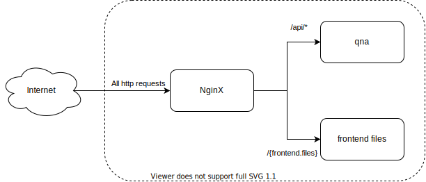

# studious-telegram
Question and answer identifier for CITS2002

# Structure

The project currently has 3 components, `qna`, `frontend`, and `nginx`. 

The `qna` module is the guts of the project performing natural language processing to compare a given question to previously asked questions. It can be run either as a web api, or as a run as a command line tool.

The `frontend` module includes the markup and styles for the UI. Currently this is a fairly simple UI to illustrate how the backend could be utilised.

The `nginx` module contains the configuration file for nginx. Nginx is a web server that can also be used as a reverse proxy. Here is it being used to serve the `frontend` module files and to reverse proxy any requests to the `qna` module.



# Environment

## Python

Require Python 3.8+

# Structure

## ProjectTree

│  .dockerignore<br>
│  .gitignore<br>
│  docker-compose.yaml
│  README.md
│  readme.txt
│  start.sh
│  
├─.idea
│  │  .gitignore
│  │  misc.xml
│  │  modules.xml
│  │  studious-telegram-main.iml
│  │  workspace.xml
│  │  
│  └─inspectionProfiles
│          profiles_settings.xml
│          
├─docker
│      nginx.dockerfile
│      qna.dockerfile
│      README.md
│      
├─docs
│  │  README.md
│  │  
│  └─diagrams
│          qnaarchitecture.drawio.svg
│          structure.drawio.svg
│          
├─frontend
│      debug-styles.css
│      debug.html
│      index.html
│      README.md
│      styles.css
│      
├─nginx
│      nginx.conf
│      README.md
│      
└─qna
    │  README.md
    │  
    └─src
        │  main.py
        │  
        └─app
            │  __init__.py
            │  
            ├─domain
            │  │  doc2vec.py
            │  │  keywordmatcher.py
            │  │  questionmatcher.py
            │  │  sent_BERT.py
            │  │  summarisation.py
            │  │  t5.py
            │  │  universalencoder.py
            │  │  __init__.py
            │  │  
            │  └─__pycache__
            │          doc2vec.cpython-38.pyc
            │          questionmatcher.cpython-38.pyc
            │          __init__.cpython-38.pyc
            │          
            ├─interface
            │  │  basiccli.py
            │  │  userinterface.py
            │  │  web.py
            │  │  __init__.py
            │  │  
            │  └─__pycache__
            │          userinterface.cpython-38.pyc
            │          __init__.cpython-38.pyc
            │          
            ├─parser
            │      json_loader.py
            │      loader.py
            │      parser.py
            │      write_to_json.py
            │      __init__.py
            │      
            ├─pretrained
            │      d2v.model
            │      d2v.model.dv.vectors.npy
            │      
            ├─testfiles
            │      help2002-2017.txt
            │      help2002-2018.txt
            │      help2002-2019.txt
            │      
            └─__pycache__
                    __init__.cpython-38.pyc
                    
# Running the project

The project can be run in two ways. 

### Locally like any other python project. 

See instructions in the [`qna/README.md`](qna/README.md). These instructions only explain how to run the project in the command line tool mode.

### In Docker

With docker installed ([Get Docker](https://docs.docker.com/get-docker/)) run the follow command

```
docker-compose up --build
```

Alternatively for UNIX based systems you can use the start script.

```
./start.sh
```

You might have to change the script permissions `chmod +x ./start.sh`


# GitHub usage

Quick rundown of the suggested git workflow.

1. Clone the repo
```
git clone https://github.com/CITS3200-2021-34/studious-telegram
```
2. Create a short-lived branch locally to add a feature/fix a bug
```
git checkout -b epic-feature

git commit -m "Changed the code to do stuff"
git push
```
3. Create a pull request using the GitHub website. Add detail about what has been changed etc.
4. Tests will run, your code gets reviewed and hopefully then merged
5. Delete the branch and start again for the next feature/bug
```
git branch -d epic-feature 
```
